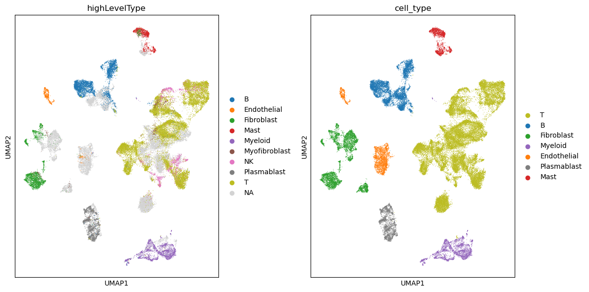

# Project 1 

## Overview

In this project, we developed a machine learning model to predict gene expresion levels from chromatin features. We began by preprocesing histone modification and chromatin accesibility data, focusing on specific genomic regions around the transcription start site (TSS) to capture meaningful signals. Chromosome data from cell lines X1 and X2 was used for training on chr2-22, then validated on chr14 and chr19. An XGBoost regressor model was trained, and predictions were made on chr1 from cell line X3. Spearman’s correlation served as a key metric, showing strong alignment with actual expresion. While we did not use the full dataset we still achieved enough performance to pass the baseline which was the main goal. 

### Prerequisites

- **Python 3.7 or higher**: Ensure Python is installed on your machine. You can download it from [here](https://www.python.org/downloads/).
- **Git**: To clone the repository. Download it from [here](https://git-scm.com/downloads).

### Running the Jupyter Notebook
   - first install the conda enviroment from environment.yaml inside the corresponding project
      ```bash
     conda env create -f environment.yaml
     conda activate  ml4g_project1
     ```
   - Run the cells sequentially to perform data pre-processing, model training, and performance evaluation.
   - 
   - To run project 1 leave the data inside root directory. Run the cells step by step.


# Project 2

Clustering of Single cell data with leidenalgorithm. 




### Prerequisites

- **Python 3.7 or higher**: Ensure Python is installed on your machine. You can download it from [here](https://www.python.org/downloads/).
- **Git**: To clone the repository. Download it from [here](https://git-scm.com/downloads).

### Running the Jupyter Notebook
   - first install the conda enviroment from environment.yaml inside the corresponding project
      ```bash
     conda env create -f environment.yaml
     conda activate  ml4g_project2
     ```
   - Run the cells sequentially to perform data pre-processing, model training, and performance evaluation.
   - 
   - To run project 1 leave the data inside root directory. Run the cells step by step.


## License

This project is licensed under the [MIT License](LICENSE).

